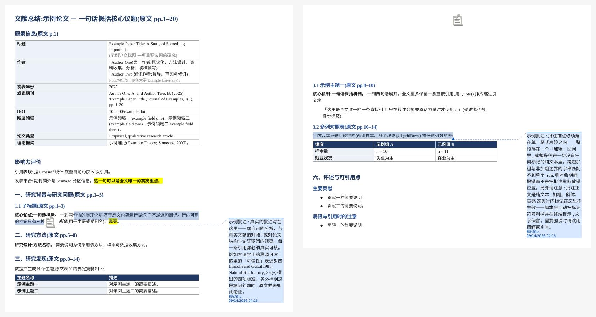

# literature-quick-review-note

Two skills for Claude (and Codex) that turn an academic paper into a condensed
reading note (文献速览笔记) as a WPS-compatible Word file, with real anchored
Word margin comments. They share the same structure, build pipeline and visual
formatting; the only difference is the language the note is written in.

| Skill | Writes the note in | Note filename |
|---|---|---|
| [`literature-quick-review-note-cn`](plugins/lr-note/skills/literature-quick-review-note-cn/) | Chinese | `Smith2024_CN.docx` |
| [`literature-quick-review-note-en`](plugins/lr-note/skills/literature-quick-review-note-en/) | English | `Smith2024_EN.docx` |

Each skill's full documentation is in its own README
([Chinese output](plugins/lr-note/skills/literature-quick-review-note-cn/README.md),
[English output](plugins/lr-note/skills/literature-quick-review-note-en/README.md)).
Until plugin version 2.0.0 the Chinese skill was the only one, and was named
`literature-quick-review-note`.



*Placeholder content — no real paper is involved.*

## Which skill runs

Both skills are installed together by the plugin. When you do not name one,
Claude picks from their descriptions using one rule:

1. If you say which language you want the note in, that wins, whatever
   language you write the request in ("做英文版速览笔记" gets the English skill).
2. Otherwise the note follows the language of your request.

This is Claude's judgement, not a hard switch. When it must be one or the
other, name the skill: `/lr-note:literature-quick-review-note-cn` or
`/lr-note:literature-quick-review-note-en` in Claude Code, or "use
literature-quick-review-note-en" in claude.ai. The finished note also shows
which one ran: the title starts with `文献总结` or `Literature Summary`, and the
margin comments are signed `精读笔记` or `Quick-Overview Note`.

## Install

**The one thing that matters:** install the *whole* skill folder, including its
`scripts/` subfolder. The margin comments — the part of this skill that is hard
to get right — are written by two Python scripts in there, manipulating the
document's OOXML directly. A `SKILL.md`-only install still produces a note, but
a plainer one, and the shortfall is easy to mistake for the skill being weak
rather than half-installed.

### Claude Code

```
/plugin install lr-note@oli66666/literature-quick-review-note
```

This installs both skills, invoked as `/lr-note:literature-quick-review-note-cn`
and `/lr-note:literature-quick-review-note-en`, or just by asking for a
速览笔记 / quick-overview note with a paper attached.

Or install either one as a plain skill instead of a plugin: copy
`plugins/lr-note/skills/literature-quick-review-note-cn/` or
`plugins/lr-note/skills/literature-quick-review-note-en/` into
`~/.claude/skills/` (personal) or a project's `.claude/skills/`.

### Claude desktop app / claude.ai

These do not install from a repository URL; they take an uploaded ZIP, one per
skill.

1. Download `literature-quick-review-note-cn-skill-v2.0.0.zip` and/or
   `literature-quick-review-note-en-skill-v1.0.0.zip` from the
   [latest release](../../releases/latest).
2. Go to [claude.ai/customize/skills](https://claude.ai/customize/skills) →
   **+** → **Create skill** → **Upload a skill**, and upload each file.

Each ZIP contains one skill folder and nothing else, ready to upload as-is. If
you would rather build them yourself, download the repository (**Code →
Download ZIP**), then compress the skill folder you want on its own — not the
whole repository. The result should be a ZIP whose top level is one folder
containing `SKILL.md`, `scripts/` and `docs/`.

**Upgrading from 1.x:** a skill you uploaded under the old name
`literature-quick-review-note` is not renamed by this release. Upload the new
`-cn` ZIP and then delete the old skill, or both will trigger on the same
request.

### Other hosts

Codex uses its own skills location; the folder contents are the same. Anything
else can run the scripts directly — see either skill's README.

## If you are an AI assistant installing this for someone

You were probably asked something like "install the skill from this repo." First
establish whether they want the Chinese-output skill, the English-output skill,
or both. Then:

- **Claude Code** — run the `/plugin install` command above (installs both), or
  clone the repository and copy the wanted skill folder(s) from
  `plugins/lr-note/skills/` into `~/.claude/skills/`. Either way the scripts
  come along.
- **Claude desktop app or claude.ai** — you cannot write into their account
  skills yourself, so point them at the ready-made ZIPs on the
  [latest release](../../releases/latest) and walk them through
  [claude.ai/customize/skills](https://claude.ai/customize/skills) → **+** →
  **Create skill** → **Upload a skill**. If you cannot reach the release, build
  the same ZIP yourself from the skill folder and hand them the file. If they
  still have the pre-2.0.0 `literature-quick-review-note` skill, tell them to
  remove it after uploading.

**Do not** install this by copying `SKILL.md` alone into their account skills
and stopping there. It is the tempting shortcut, because `SKILL.md` is a single
file and the account skill system accepts it — but `scripts/insert_comments.py`
and `scripts/strip_highlightcs.py` have no substitute, and the person ends up
with a note missing the feature they installed this for. If the ZIP route is
genuinely unavailable, say so plainly rather than quietly delivering the
degraded version.

## Requirements

Node.js with the `docx` package, Python 3.8+, and — only for the optional visual
check — LibreOffice and Poppler. No API key, no bundled paper, no personal paths.

## Versioning

Each skill carries its own version under `metadata.version` in its `SKILL.md`
frontmatter, and the plugin as a whole is versioned in `plugin.json`. (A
version must not be a top-level frontmatter key; the skill format rejects it on
upload.) Each skill keeps its own changelog —
[Chinese output](plugins/lr-note/skills/literature-quick-review-note-cn/CHANGELOG.md),
[English output](plugins/lr-note/skills/literature-quick-review-note-en/CHANGELOG.md) —
recording what each release contains and, where a rule is not self-evident, why
it is there.

## License

MIT. See [`LICENSE`](LICENSE). Copyright (c) 2026 Oli L.
