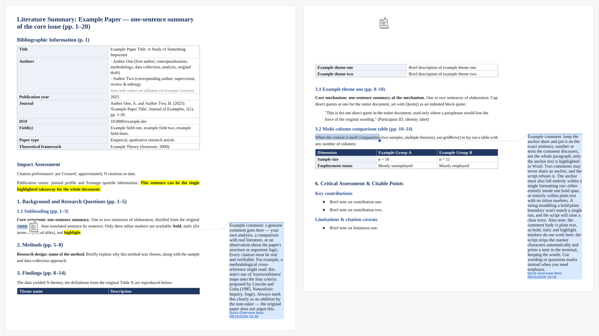

# Literature Quick-Overview Note (English)

A Claude/Codex-compatible skill for producing a condensed academic reading note as a WPS-compatible Word (`.docx`) file, written entirely in English. It also includes portable Node.js and Python scripts for building, commenting, validating, and rendering the document.

This is the English-output sibling of [`literature-quick-review-note-cn`](../literature-quick-review-note-cn/): same repository, same plugin, same underlying scripts — the difference is the language the note itself is written in, not what the note does.



*Generated by the commands under [Standalone script workflow](#standalone-script-workflow). The content is placeholder text — no real paper is involved.*

## Installation

Install the **whole folder**, `scripts/` included. The margin comments are
written by two Python scripts in there that manipulate the document's OOXML
directly, and they have no fallback. A `SKILL.md`-only install still produces a
note, but without comments — see [Copying only `SKILL.md`](#copying-only-skillmd).

**Claude desktop app (Cowork), as a plugin (recommended).** Open **Customize →
Plugins → Add → Add from a repository**, enter
`oli66666/literature-quick-review-note`, and install **Lr note**. It installs
both this skill and its Chinese-output sibling. To pick up a new version, use
**Update** on the marketplace; automatic sync needs the Claude GitHub App to
have access to the repository.

**Claude Code, as a plugin.**

```
/plugin marketplace add oli66666/literature-quick-review-note
/plugin install lr-note@literature-quick-review-note
```

The part after `@` is the marketplace's name, not the GitHub path. This
installs the whole `lr-note` plugin, which contains both this skill and its
Chinese-output sibling. This one is invoked as
`/lr-note:literature-quick-review-note-en`, or just by asking for an English
quick-overview / quick-review reading note with a paper attached. Plugin
skills are always namespaced by the plugin they come from, which is where the
`lr-note:` prefix comes from. To receive new versions, turn on auto-update for
the marketplace under `/plugin` → **Marketplaces**.

**Claude Code, by hand.** Copy this folder into `~/.claude/skills/` (personal) or
a project's `.claude/skills/` (project-only).

**claude.ai chat.** Plugins are not available in chat, so upload a ZIP instead.
Chat does not install from a repository URL. Compress *this* folder on its own — the ZIP's top level should
be one folder containing `SKILL.md`, `scripts/` and `docs/` — then go to
[claude.ai/customize/skills](https://claude.ai/customize/skills) → **+** →
**Create skill** → **Upload a skill**.

**Other hosts.** Codex uses its own skills location; the folder contents are the
same. Anything else can run the scripts directly.

## What it does

- Creates real Word Heading 1/2/3 styles for navigation.
- Adds source-PDF page ranges to content headings.
- Produces a condensed overview rather than a paragraph-by-paragraph restatement.
- Adds genuine anchored Word margin comments — a feature most `.docx` libraries cannot write at all. Comment bodies are plain text; inline markers are stripped automatically with a note, since they only apply to the document body.
- Handles multi-column comparison tables, block quotes, and `**bold**` / `*italic*` / `==highlight==` inline markers.
- Includes a WPS compatibility fix, lightweight validation, and a render-and-look visual check.

## Compatibility

The instruction file is intended for Claude and Codex installations that support `SKILL.md` skills. Other AI systems may use the scripts directly or adapt `SKILL.md` to their own skill format. Automatic triggering is not guaranteed outside a compatible skill system.

Tested in both Claude and Codex. The scripts behave identically; note quality depends on the host model, and in the author's testing Claude produced noticeably better notes. Treat Codex as supported-but-secondary.

## Output language

Notes are written in English by design, regardless of what language the source paper is in — this skill exists for a reader who wants their reading notes in English. Its sibling, [`literature-quick-review-note-cn`](../literature-quick-review-note-cn/), writes the note in Chinese instead, for a Chinese-speaking reader absorbing an English (or other-language) paper quickly. Installing the `lr-note` plugin gives you both. `SKILL.md` and all scripts are in English either way, and the formatting layer is language-agnostic — the two skills share every script except one CLI default in `insert_comments.py` (the margin-comment author label).

When both are installed, the choice between them follows one rule, written into both skills' descriptions: an output language the user names explicitly wins ("做英文版笔记" comes here even though the request is in Chinese); otherwise the note follows the language of the request. This is Claude's judgement from the descriptions, not a hard switch, so invoke a skill by name when it must be one or the other.

Note files are named after the paper with a language suffix: `Smith2024_EN.docx` here, `Smith2024_CN.docx` from the Chinese skill, so the two never overwrite each other.

## Requirements

- Node.js and the `docx` npm package.
- Python 3.8+.
- LibreOffice and Poppler only for the optional visual-rendering check.
- A source paper supplied by the user. This repository does **not** include any paper PDF.

## Standalone script workflow

Run from **this folder** (the one containing `SKILL.md`), not from the repository root:

```bash
npm install --prefix scripts
node scripts/example_build.js
python3 scripts/strip_highlightcs.py example_note.docx
python3 scripts/insert_comments.py example_note.docx scripts/example_comments.json
python3 scripts/validate_docx.py example_note.docx
bash scripts/render_preview.sh example_note.docx --comments
```

Before and after editing anything in `scripts/`, run the unit checks:

```bash
python3 scripts/test_scripts.py
```

These check the two Python scripts that manipulate OOXML internals — comment
anchoring and the WPS fix — where a one-line mistake produces a file Word or WPS
refuses to open, or a margin comment attached to the wrong sentence. They need no
third-party packages and no source paper, and they are a different test from
running the skill on a real paper: that proves the pipeline works today, this
proves it still works after a change.

`--comments` renders the Word margin comments into the PDF margin, which is how the screenshot above was produced; drop the flag for a faster render.

Note the `bash` prefix on the last command: it runs the script without depending on the file's executable bit, which does not always survive a clone. If you prefer `./scripts/render_preview.sh`, run `git update-index --chmod=+x scripts/render_preview.sh` once so the executable bit is recorded in the repository.

`scripts/package-lock.json` is committed, so `npm install` reproduces the exact dependency tree this repository was tested against. `node_modules/` and all generated `.docx`, `.pdf`, and image files are excluded by the repository's `.gitignore` at every directory level.

## Copying only `SKILL.md`

Some skill systems sync only the instruction file and not the `scripts/` folder. `SKILL.md` has an "If `scripts/` is missing" section covering this: the Visual formatting section specifies every font, size, colour and spacing value the JavaScript helpers encode, so they can be rebuilt from the instructions alone and produce byte-identical formatting. The two Python scripts have no equivalent fallback — they manipulate OOXML internals — so a scripts-less install should deliver a note without margin comments rather than improvise comment XML.

## Batch use

The skill processes multiple papers **strictly one at a time**: it finishes, verifies, and delivers each note before reading the next paper, and does not wait for a new instruction between papers. This is deliberate — holding several papers in context at once is how findings, sample sizes, and page numbers get attributed to the wrong paper. See the "Batch mode" section of [`SKILL.md`](SKILL.md) for the queue protocol and the mandatory post-build verification pass.

## Privacy and copyright boundary

- Do not commit paper PDFs, private reading notes, personal data, emails, API keys, cookies, or generated documents containing confidential material.
- Generated `.docx` files embed authoring metadata (`docProps/core.xml` carries `creator` and `lastModifiedBy`), so a committed output leaks a name even when its text looks harmless. The `.gitignore` excludes build artifacts at every directory level for this reason.
- Any example screenshot must be produced from the placeholder example, never from a real paper — both to avoid copyright issues and to keep your own notes and annotations out of the repository.
- The skill does not require a personal filesystem path, and the scripts make no network requests of their own.
- Citation and journal-metric lookups must use real, verifiable sources. The host agent's web/API access is not bundled with this repository.

## Versioning

The version number lives under `metadata.version` in `SKILL.md`'s frontmatter —
not as a top-level key, which the skill format rejects.
[`CHANGELOG.md`](CHANGELOG.md) records what each release contains and, where a
rule is not self-evident, why it is there.

## License

MIT License. See [`LICENSE`](../../../../LICENSE).
